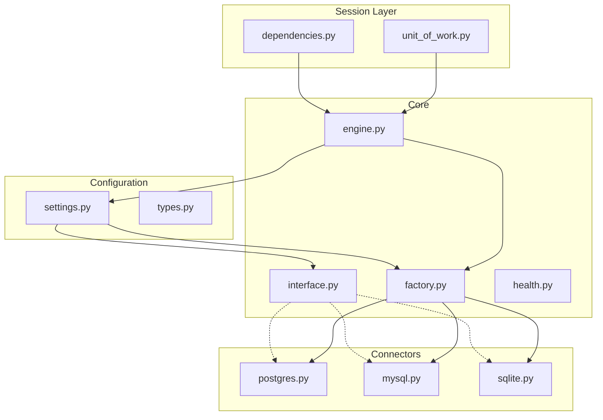

# Agent BluePrint


> **The definitive asynchronous Python foundation for building production-grade AI agents and scalable microservices.**

## 📖 Introduction

**Agent BluePrint** is not just another template; it's a curated architectural pattern designed for software engineers who demand precision, scalability, and maintainability.

Building AI agents requires orchestration of complex components: LLM providers, vector stores, relational databases, and observability pipelines. This repository abstracts the boilerplate, providing a **type-safe**, **modular**, and **async-native** foundation so you can focus on the intelligence, not the infrastructure.

## 🏗️ Architecture

This project enforces a clean separation of concerns, ensuring your application remains testable and adaptable as it grows.

### Database Architecture

The database layer (`db/`) uses a modular factory pattern to support multiple backends (PostgreSQL, MySQL, SQLite) while providing a unified session management interface via dependency injection and Unit of Work patterns.



### Directory Structure

```text
/
├── ai/                 # AI capabilities & Tool definitions
│   ├── prompts/        # System prompts & personas
│   └── tools/          # Agent capabilities (File I/O, Search, etc.)
├── config/             # Type-safe Configuration (Pydantic)
├── db/                 # Database Module
│   ├── configuration/  # Settings & Type definitions
│   ├── connectors/     # Database-specific implementations
│   ├── core/           # Engine, Factory, & Interface logic
│   └── session/        # Dependency Injection & Unit of Work
├── telemetry/          # Observability & Structured Logging
└── .env.example        # Environment template
```

## ✨ Key Features

*   **⚡ Async-First Core**: Built on top of `SQLAlchemy 2.0+` (AsyncIO) and `FastAPI` patterns for high-concurrency performance.
*   **🛡️ Type-Safe Configuration**: Leverages `pydantic-settings` for robust environment validation. Fail fast if your config is wrong.
*   **🧩 Modular Database Layer**: Switch between PostgreSQL, MySQL, or SQLite via simple config changes. No code refactoring required.
*   **🧠 AI-Ready**: Dedicated structures for `prompts` and `tools`, compatible with modern agentic frameworks (LangChain, AutoGen, Claude).
*   **🔍 Observability**: Pre-configured structured logging using `rich` for crystal-clear development logs and production traceability.

## 🚀 Getting Started

### Prerequisites

*   **Python 3.10+**
*   **Git**
*   **PostgreSQL** (Recommended for production)

### Installation

1.  **Clone the repository**
    ```bash
    git clone https://github.com/your-username/agent-blueprint.git
    cd agent-blueprint
    ```

2.  **Set up Virtual Environment**
    ```bash
    python -m venv venv
    source venv/bin/activate  # Windows: venv\Scripts\activate
    ```

3.  **Install Dependencies**
    ```bash
    pip install sqlalchemy[asyncio] pydantic-settings python-dotenv rich asyncpg aiomysql aiosqlite
    ```

### Configuration

Create a `.env` file in the root directory.

```ini
# --- General ---
ENV=development
PRODUCT_NAME=AgentBluePrint
APP_URL=http://localhost:8000

# --- Database ---
# Supported Types: postgres, mysql, sqlite
DB_TYPE=postgres
DB_HOST=localhost
DB_PORT=5432
DB_NAME=agent_db
DB_USER=postgres
DB_PASSWORD=secret

# --- AI Providers ---
OPENAI_API_KEY=sk-...
ANTHROPIC_API_KEY=sk-ant-...
```

## 💻 Usage

### Dependency Injection (FastAPI)

Inject a database session directly into your routes or controllers.

```python
from db import get_db_session
from sqlalchemy.ext.asyncio import AsyncSession

async def create_user(session: AsyncSession = Depends(get_db_session)):
    # Session is automatically created and closed
    user = await session.get(User, 1)
    return user
```

### Atomic Transactions (Unit of Work)

Ensure data integrity with the Unit of Work context manager.

```python
from db import UnitOfWork

async def process_order(order_id: str):
    async with UnitOfWork() as session:
        # All operations here are atomic
        repo = OrderRepository(session)
        await repo.mark_paid(order_id)
        await repo.ship_items(order_id)
    # Automatically committed if successful, rolled back on error
```

## 🤝 Contributing

We welcome contributions! Please see `CONTRIBUTING.md` for details.

1.  Fork the repo
2.  Create your feature branch (`git checkout -b feature/AmazingFeature`)
3.  Commit your changes (`git commit -m 'Add some AmazingFeature'`)
4.  Push to the branch (`git push origin feature/AmazingFeature`)
5.  Open a Pull Request

## 📄 License

Distributed under the MIT License. See `LICENSE` for more information.
